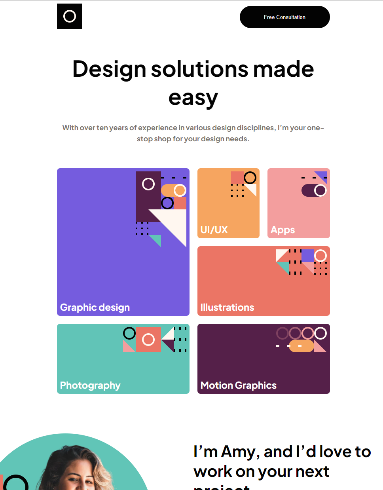

# Single Page Portfolio [November 6th 2022]

This project is one of the junior Javascrpit challenges from [Frontend Mentor](https://www.frontendmentor.io/).

## Table of contents

- [Overview](#overview)
  - [Screenshot](#screenshot)
  - [Links](#links)
  - [Features](#features)
- [My process](#my-process)
  - [Built with](#built-with)
  - [What I learned](#what-i-learned)
  - [Continued development](#continued-development)
  - [Useful resources](#useful-resources)
- [Author](#author)
- [Acknowledgments](#acknowledgments)

## Overview

In this project, the goal was to create a responsive portfolio website.

### Screenshots

### Links

- Live Site URL: [Single Page Portfolio](https://funny-sunshine-3dbe44.netlify.app/)

### Features

- Displays hover states on all buttons
- Responsive Layout for mobile and tablet functionality

## My process

I started by looking at figma files and writing down the possible routes I can take in terms of setting up my files. I then strctured my HTML file, then i used the figma file to get the appropriate colors and sizing to set up my CSS file.

### Built with

- HTML
- CSS
- Javascript
- Swiper Js

### What I learned

This project was a slight challenge as it was my first time utilizing CSS grid in a project, but i got it done. I also had to chance to use [Swiper JS](https://swiperjs.com/) for the slider functionality which was really cool.

### Continued development

In the future, i would like to modify the design.

### Useful resources

- [Frontend Mentor](https://www.frontendmentor.io/).

## Author

- Jaron Denzel Young

## Acknowledgments

Thank you, Frontend Mentor, for being an awesome place to learn.
